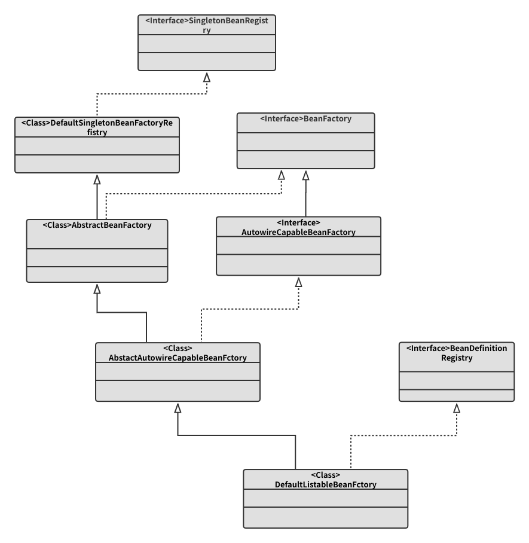
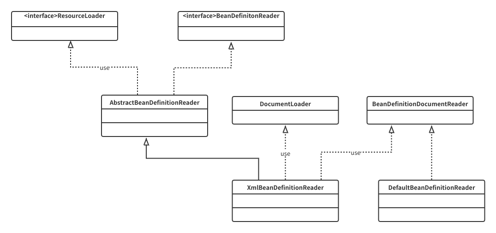

# 更新记录

## spring-light

> 分支 bean-definition

主要改动

- 新增BeanDefinition类(主要功能是保存bean信息)
- 新增BeanDefinitionRegistry接口(定义对 BeanDefinition 的各种增删改操作)
- 默认的ioc容器实现BeanDefinitionRegistry接口
- ioc容器的基本实现



Test代码

```
public class DefaultListableBeanFactoryTest {
    @Test
    public void testDefaultListableBeanFactoryWithBeanDefinition() {
        DefaultListableBeanFactory defaultListableBeanFactory = new DefaultListableBeanFactory();
        BeanDefinition beanDefinition = new BeanDefinition();
        beanDefinition.setClazz(HelloBeanDefinition.class);
        defaultListableBeanFactory.registerBeanDefinition("helloBeanDefinition", beanDefinition);
        Object helloBeanDefinition = defaultListableBeanFactory.getBean("helloBeanDefinition");
        assertNotNull(helloBeanDefinition);
        assertEquals(((HelloBeanDefinition)helloBeanDefinition).sayHello(),"Hello BeanDefinition");
    }
}

`class HelloBeanDefinition {

    public String sayHello() {
        System.out.println("Hello BeanDefinition");
        return "Hello BeanDefinition";
    }
}
```

> 分支 bean-definition-parse

主要改动

- 新增InputStreamResource和Resource接口和其实现(对资源的获取和扩展)
- 新增BeanDefinitionReader接口和实现(将Resource资源转换为BeanDefinition)
- 新增DocumentLoader接口（将Resource资源转换为Document）
- 新增抽象类AbstractBeanDefinitionReader默认实现BeanDefinitionReader接口并提供注册BeanDefinition



Test代码

```
public class XmlBeanFactoryTest {
    @Test
    public void testXmlBeanFactory() {
        ClasspathResource resource = new ClasspathResource("hello.xml");
        XmlBeanFactory xmlBeanFactory = new XmlBeanFactory(resource);
        BeanDefinition bd = xmlBeanFactory.getBeanDefinition("person");
        assertEquals(bd.getClazz(), Person.class);
    }

}
```
> 分支 factory-bean

主要改动

- 新增FactoryBean(隐藏实例化复杂bean的细节)

    * 通过transformName()方法获取beanName;
    * 拿到原始的bean状态
    * 通过getObjectForBeanInstance()方法获取到最终想要的bean

        * getObjectForBeanInstance(beanInstance,name,beanName,bd)方法
        * 如果name是否以&符号开头并beanInstance不是FactoryBean则非法
        * 获取普通bean或FactoryBean实例
        * 获取FactoryBean的getObject实例
        * 从getObjectFromFactoryBean中获取
    